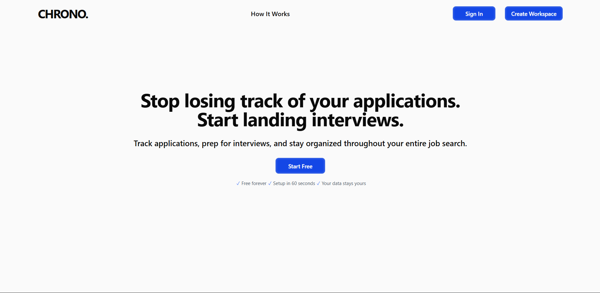
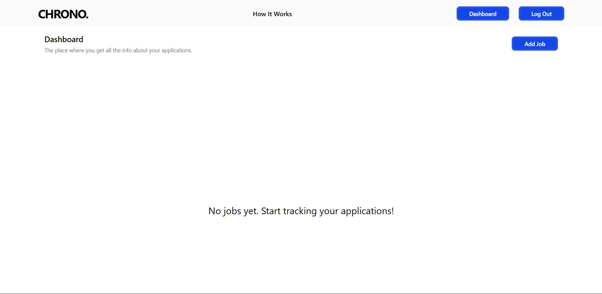
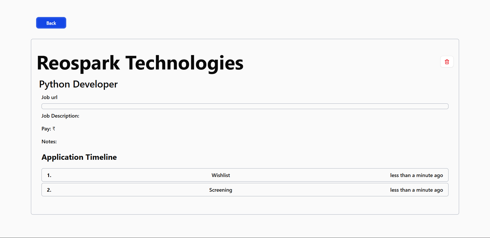

# Chrono - Job Application Tracker

A full-stack web application for managing and tracking job applications throughout your job search journey. Built with Next.js, TypeScript, MongoDB, and Tailwind CSS.

## 🚀 Live Demo

[View Live Application](https://chrono-rust.vercel.app/)

## 📋 Overview

Chrono helps job seekers organize their application process by tracking jobs, managing application statuses, and maintaining a timeline of their progress with each company. Never lose track of where you are in the hiring process again.

## ✨ Features

- **User Authentication** - Secure registration and login with JWT tokens
- **Job Management** - Create, read, update, and delete job applications
- **Status Tracking** - Track application progress through customizable stages (Wishlist, Applied, Interview, Offer, Rejected)
- **Timeline History** - Automatic timeline tracking of status changes with timestamps
- **Responsive Design** - Works seamlessly on desktop and mobile devices
- **Real-time Feedback** - Loading states and error handling for better UX

## 🛠️ Tech Stack

**Frontend:**

- Next.js 14
- TypeScript
- Tailwind CSS
- React Hooks
- Context API

**Backend:**

- Node.js + Express.js + JavaScript
- JWT Authentication
- bcrypt for password hashing

**Database:**

- MongoDB
- Mongoose ORM

## 🏃 Getting Started

### Prerequisites

- Node.js 18+ installed
- MongoDB Atlas account (or local MongoDB instance)
- Git

### Installation

1. Clone the repository

```bash
git clone https://github.com/vishalgupta-02/chrono.git
cd chrono
```

2. Install dependencies

```bash
npm install
```

3. Set up environment variables

Create a `.env.local` || `.env` file in the root directory:

```
MONGODB_URI=your_mongodb_connection_string
JWT_SECRET=your_jwt_secret_key
```

4. Run the development server

```bash
npm run dev
```

5. Open [http://localhost:3000](http://localhost:3000) in your browser

## 📱 Usage

1. **Register** - Create a new account
2. **Login** - Access your dashboard
3. **Add Jobs** - Click "Add Job" and fill in the details
4. **Track Progress** - Update job status as you progress through applications
5. **View Timeline** - See your complete application history for each job
6. **Manage Applications** - Edit or delete jobs as needed

## 🗂️ Project Structure

```
chrono/
├── app/                    # Next.js app directory
│   ├── api/               # API routes
│   ├── dashboard/         # Protected dashboard pages
│   └── page.tsx           # Landing page
├── models/                # Mongoose schemas
│   ├── User.ts
│   └── Job.ts
├── lib/                   # Utility functions
│   └── db.ts             # Database connection
├── components/            # React components
└── public/               # Static assets
```

## 🔐 API Endpoints

### Authentication

- `POST /api/auth/register` - Register new user
- `POST /api/auth/login` - Login user

### Jobs (Protected)

- `GET /api/jobs` - Get all user's jobs
- `POST /api/jobs` - Create new job
- `GET /api/jobs/:id` - Get single job
- `PUT /api/jobs/:id` - Update job details
- `DELETE /api/jobs/:id` - Delete job
- `PATCH /api/jobs/:id/status` - Update job status (adds timeline entry)

## 🎯 Key Features Explained

### Timeline Tracking

Every time you change a job's status, JobFlow automatically creates a timeline entry with:

- The new status
- Timestamp of the change
- Complete history of your application journey

### Status Pipeline

Track jobs through five stages:

- **Wishlist** - Jobs you're interested in
- **Applied** - Applications submitted
- **Interview** - Interview scheduled/completed
- **Offer** - Offer received
- **Rejected** - Application unsuccessful

## 🚧 Future Enhancements (Phase 2)

- Interview tracking with rounds and notes
- Contact/recruiter management
- Document storage for resumes and cover letters
- Chrome extension for one-click job saving
- Analytics dashboard
- Email reminders for follow-ups

## 📸 Screenshots

## Home



### Dashboard



### Job Timeline



## 🤝 Contributing

This is a personal portfolio project, but suggestions and feedback are welcome! Feel free to open an issue.

## 📝 License

This project is open source and available under the [MIT License](LICENSE).

## 👤 Author

**Your Name**

- GitHub: [Vishal-Gupta](https://github.com/vishalgupta-02)
- LinkedIn: [Vishal Gupta](https://www.linkedin.com/in/vishal-gupta-16018719a)
- Twitter: [Vishal_Gupta](https://x.com/VishalG41764750)

## 🙏 Acknowledgments

Built as part of my journey to learn full-stack development and demonstrate professional project completion. Built in public over few(don't know the exact timeline) days.

---

**Built with ❤️ by Vishal Gupta**
